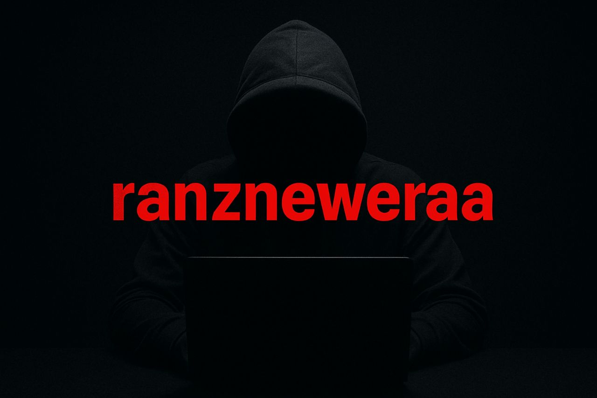

<h1 align="center">
   RANZ USERBOT 
</h1>

<p align="center">
  <a href="https://github.com/wenzubot/userbotranz/commits">
    
  </a>
</p>

<p align="center">
  <a href="https://github.com/wenzubot/userbotranz">
    
  </a>
  <a href="https://github.com/wenzubot/userbotranz/graphs/commit-activity">
    
  </a>
  <a href="https://app.codacy.com/gh/wenzubot/userbotranz/dashboard">
    
  </a>
</p>

<p align="center">
  <a href="https://github.com/wenzubot/userbotranz/fork">
    
  </a>
  <a href="https://github.com/wenzubot/userbotranz/stargazers">
    
  </a>
</p>

<p align="center">
  
</p>

<h3 align="center">
  👩‍💻 Ranzneweraa-Userbot adalah userbot Telegram modular yang berjalan di Python3 dengan database sqlalchemy.
</h3>

Berbasis [Paperplane](https://github.com/RaphielGang/Telegram-UserBot) dan [ProjectBish](https://github.com/adekmaulana/ProjectBish) userbot.  
Repository ini dibuat untuk memilih dan menambahkan modul sesuai kebutuhan dengan banyak perubahan dan fitur baru.

---

## Disclaimer

Saya tidak bertanggung jawab atas penyalahgunaan bot ini. Bot ini dimaksudkan untuk bersenang-senang sekaligus membantu anda mengelola grup secara efisien dan mengotomatiskan beberapa hal yang membosankan. Gunakan bot ini dengan risiko Anda sendiri, dan gunakan userbot ini dengan bijak.

---

<details>
<summary><b>🔗 String Session</b></summary>
<br>

> Anda memerlukan API_ID & API_HASH untuk menghasilkan sesi telethon. Ambil APP ID dan API Hash di [my.telegram.org](https://my.telegram.org)

### Generate Session via Repl
<p>
<a href="https://repl.it/@AyiinXd/AyiinString?lite=1&outputonly=1">
  
</a>
</p>

### Generate Session via Telegram StringGen Bot
<p>
<a href="https://t.me/GeneratorStringRobot">
  
</a>
</p>

</details>

<details>
<summary><b>🔗 Deploy di VPS</b></summary>
<br>

### Tutorial Deploy di VPS

```bash
git clone https://github.com/wenzubot/userbotranz
cd userbotranz
pip3 install -U -r requirements.txt
mv sample.env .env
nano .env
# isi vars, ctrl+S lalu ctrl+X
screen -S userbotranz
bash start